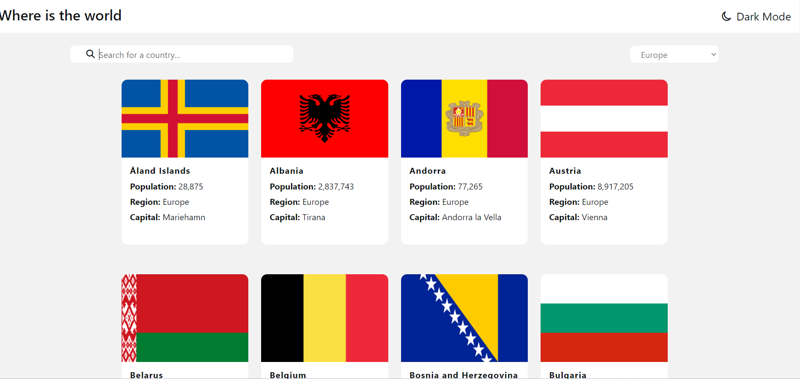
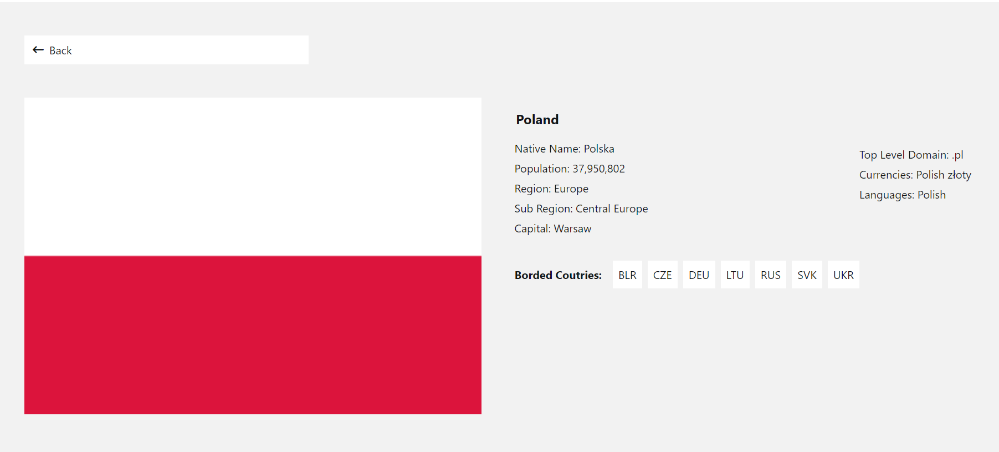
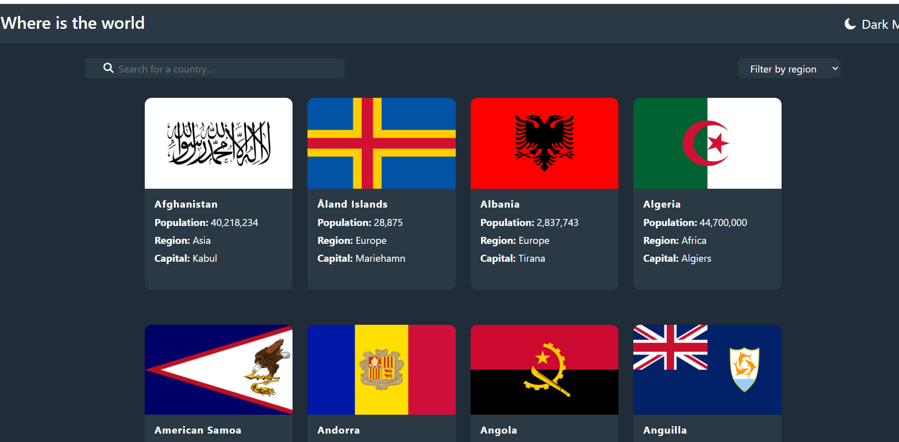

## Project Name & Pitch

Flags project

An application used to display countries data. Data are fetched from countries-api. Built with Angular,
Typescript, SCSS, RxJS and Ngrx components store.

#### Core features

- display basic information about countries in the list 
- possibility to filter countries by region and search by name
- dark mode
- display country details in separate tab when user clicks on specific country

#### Live version: https://learn-about-flags.netlify.app/

## Project Status

Project is almost done. I want to add better error handling and functional tests

## Project Screen Shots

Countries main page

Coutries details

Dark mode

## Installation and Setup Instructions

Clone down this repository. You will need `node` and `npm` installed globally on your machine.

Installation:

`npm install`

To Start Server:

`npm start`

To Run unit tests:

`npm run test`

To Visit App:

`localhost:4200/`

## Reflection

This project was built as a challenge to learn how to use ngrx component store in practice.

I could practise also basic Angular concepts like Components and communication between them, Angular Router, creating streams with rxjs and http requests.

